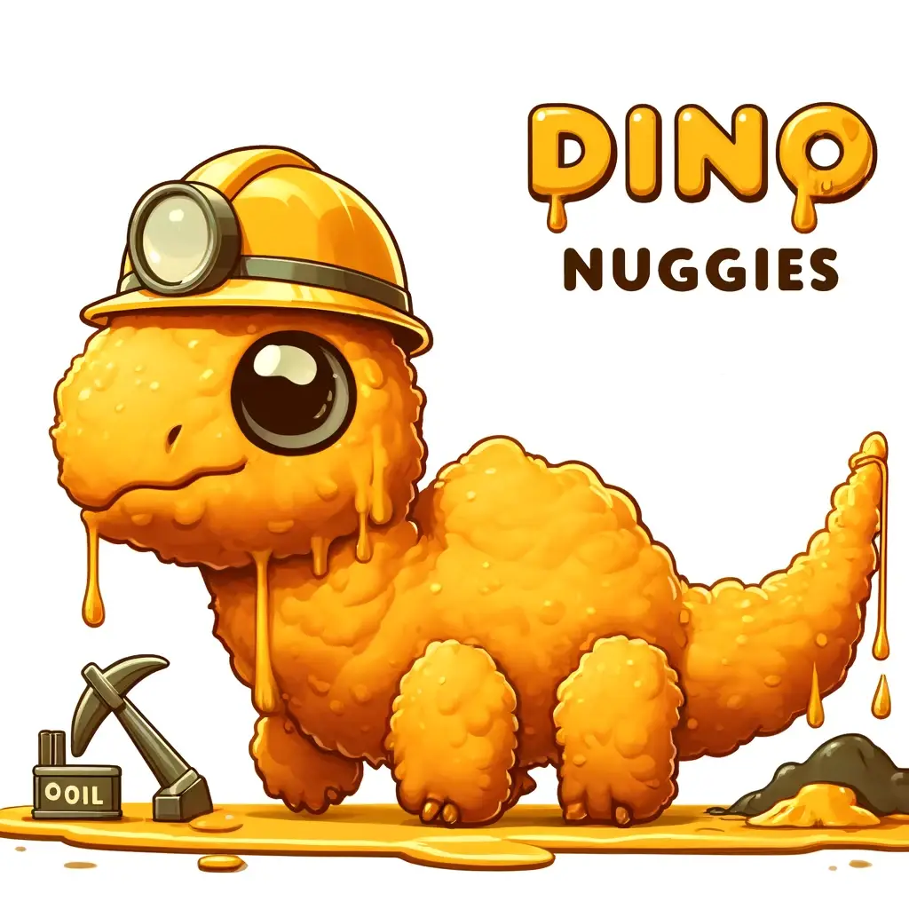

# Dino-Nuggies
DataHacks 2024 team

# Dino Nuggies: Dinosaurs and Modern Energy Analysis

Our project, "Dino Nuggies," ventures into the fascinating correlation between the locations of dinosaur fossils and the modern-day geographic distribution of fossil fuel production. We present an interactive set of plots that showcase the historical resting places of dinosaurs juxtaposed with current data on oil, coal, and gas production across various countries.

Our predictive plot for 2024, based on data from 2020 and the quantity of dinosaur bones found in each country, aims to provide an insightful forecast into the future of energy resources.

## Plots Overview

1. **Dinosaur Bone Distribution:** A map indicating the number of dinosaur bones found in each country.
2. **Oil Production Analysis:** A visualization of oil production quantities by country, compared to the dinosaur bone distribution.
3. **Coal and Gas Production:** Similar to the oil production plot, these maps show coal and gas production in each country in relation to dinosaur fossil sites.
4. **Predictive Energy Plot for 2024:** Using historical data and dinosaur bone discoveries, we extrapolate a predictive model for potential fossil fuel production in the year 2024.

## Conclusion

Our analysis leads to intriguing possibilities that tie the prehistoric past with our energy present and future. Stay tuned for our conclusion where we summarize our findings and provide insights into how these ancient patterns may influence modern energy landscapes.

## References

- [Fossil Fuel Registry](https://fossilfuelregistry.org/datasets)
- [Paleobio Database](https://paleobiodb.org/classic/displayDownloadGenerator)

## Future Directions

We plan to refine our predictive models further and expand our dataset to cover more geographical locations and historical data points. This will allow us to provide even more accurate forecasts and deeper insights into the connection between the prehistoric ecosystem and current energy sources.

## Technologies Used

- Python for data analysis and predictive modeling
- JavaScript and D3.js for interactive data visualizations
- HTML/CSS for webpage structure and design

## Credits

This project has been a collaborative effort, and we would like to thank all those who contributed data, insights, and technical expertise.

## License

This project is licensed under the MIT License - see the LICENSE.md file for details.

