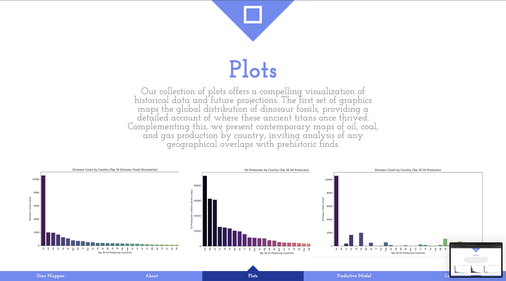
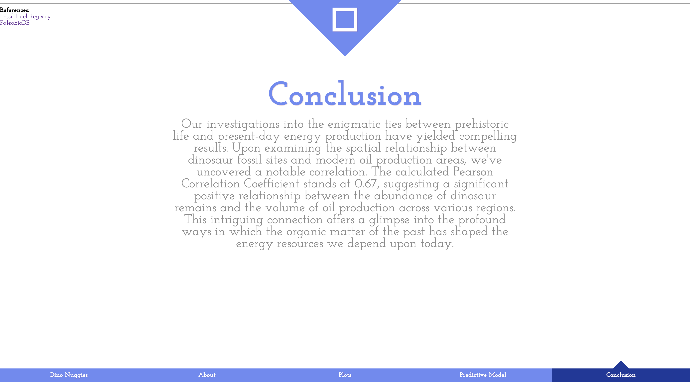

# Dino-Nuggies
DataHacks 2024 team

# Dino Nuggies: Dinosaurs and Modern Energy Analysis

Our project, "Dino Nuggies," ventures into the fascinating correlation between the locations of dinosaur fossils and the modern-day geographic distribution of fossil fuel production. We present a set of plots that showcase the historical resting places of dinosaurs juxtaposed with current data on oil, coal, and gas production across various countries.

Our predictive plot for 2025, based on data from 2020 and the quantity of dinosaur bones found in each country, aims to provide an insightful forecast into the future of energy resources.

## Setup
Your machine will need numpy, pandas, flask, seaborn, plotly, and matplotlib to run this code. To get any of these libraries, you can just `pip install [insert library here]` in a terminal window. To run the code, first pull the github to your computer and then navigate to the folder where app.py is. Then open terminal and run the command `python3 app.py`. This will direct you to a localhost website where you can interact with the product.

## The Site

### Homepage:

### About:

### Plots:

### Predictive Model:

### Conclusion & References:

## Plots Overview

1. **Dinosaur Bone Distribution:** A map indicating the number of dinosaur bones found in each country.
2. **Oil Production Analysis:** A visualization of oil production quantities by country, compared to the dinosaur bone distribution.
3. **Bone and Oil Comparison:** Comparison between bone dinosaur bone distribution and oil production in each country.
4. **Predictive Oil Production Plot for 2025:** Using historical data and dinosaur bone discoveries, we extrapolate a predictive model for potential oilproduction in the year 2025.

## Conclusion

Our analysis leads to intriguing possibilities that tie the prehistoric past with our energy present and future. Stay tuned for our conclusion where we summarize our findings and provide insights into how these ancient patterns may influence modern energy landscapes.

## References

- [Fossil Fuel Registry](https://fossilfuelregistry.org/datasets)
- [Paleobio Database](https://paleobiodb.org/classic/displayDownloadGenerator)

## Future Directions

We plan to refine our predictive models further and expand our dataset to cover more geographical locations and historical data points. This will allow us to provide even more accurate forecasts and deeper insights into the connection between the prehistoric ecosystem and current energy sources.

## Technologies Used

- Python
- HTML
- CSS
- matplotlib
- seaborn
- pandas
- numpy
- flask
- plotly

## Credits

This project has been a collaborative effort between Ethan Perez and Derrick Lin

## License

This project is licensed under the MIT License - see the LICENSE.md file for details.

